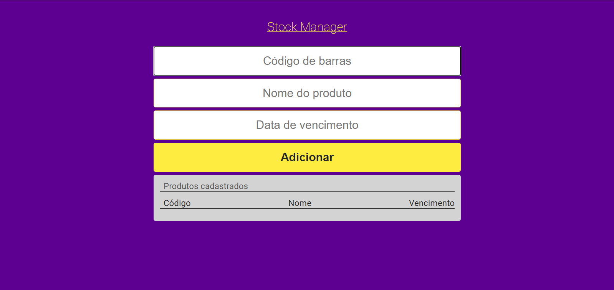

# Estudos de NodeJS 🚀

## Objetivo 🎯

Publicar meus estudos e, consequentemente, minha evolução durante o processo de voltar os estudos em NodeJS.

---

## Stock Manager - Primeira Aplicação

Aplicação para simular o cadastro de estoque de produtos de uma loja, utilizando seu código de barras, nome, data de vencimento. Aplicação encontrada na branch MASTER.

### Tecnologias utilizadas

BACK-END:

- NodeJS
    - http
    - path
    - fs
    - nodemon (dependência de desenvolvimento)
- JSON

FRONT-END:

- HTML
- CSS
- Javascript

